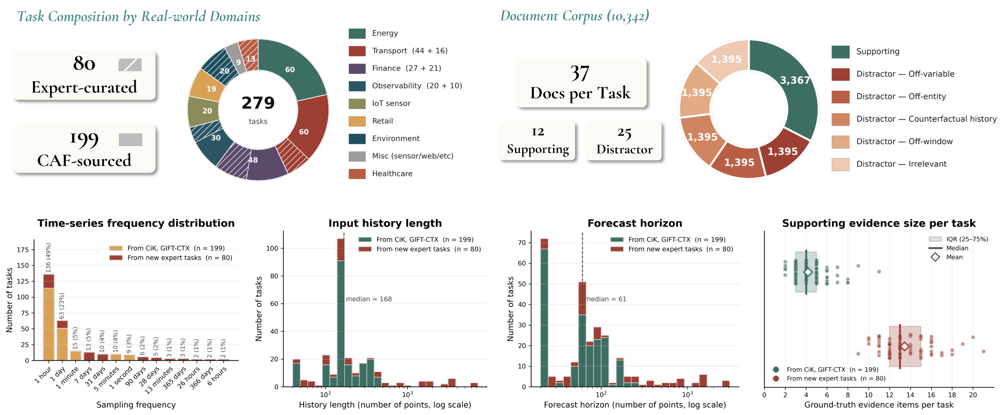

<p align="center">
  <a href="https://servicenow.github.io/Dr-CiK/">
    
  </a>
</p>

<p align="center">
  <a href="https://servicenow.github.io/Dr-CiK/"></a>
  <a href="https://arxiv.org/abs/2605.27904"></a>
  <a href="https://huggingface.co/datasets/ServiceNow/Dr-CiK"></a>
  <a href="https://creativecommons.org/licenses/by/4.0/"></a>
</p>

# Dr-CiK: A Benchmark testing Deep Research for Context-Aided Forecasting

Dr-CiK is a benchmark for evaluating whether agents can **retrieve
forecasting-relevant context from a noisy document corpus, filter out
distractors, distill the retrieved context into forecast-useful evidence, and
produce forecasts grounded in that evidence.**

Real-world time-series forecasting often depends not only on historical
observations but also on external context that must be *actively discovered*
from heterogeneous, noisy information sources. Existing context-aided
forecasting benchmarks typically assume the supporting context is already
provided. Dr-CiK removes that assumption: each task pairs a time series with a
corpus of supporting **and** distractor documents, and the agent must find and
use the right evidence on its own.


<sub>Figure 1 from the current arXiv version.</sub>

## The task

Each task provides:

- a historical time series and the ground-truth continuation to forecast;
- entity / profile metadata and a target description;
- a corpus of Markdown **documents** — a mix of *supporting* documents (which
  contain the evidence needed to forecast) and *distractor* documents (which do
  not); and
- ground-truth evidence (`gt_evidence`) for evaluation.

An agent must retrieve the supporting documents, reject the distractors,
extract the relevant evidence, and forecast the future values. Each task includes
exactly five distractor documents per distractor subtype (`confounder`, `noisy`,
`timeseries`, `profile`, `temporal`).

## Dataset at a glance

| Item | Count |
| --- | ---: |
| Tasks | 279 |
| Supporting documents | 3,367 |
| Distractor documents | 6,975 |
| Total documents | 10,342 |

Task sources: 199 synthetic, 80 human-authored. The original context-prompt
fields (`background`, `instruction`, `constraints`, `full_text`) are
intentionally excluded from the public release.

**Splits.** The dataset ships a public **dev** set and a hidden **test** set (filter on
the `labels_public` field):

| Split | Tasks | Origin | `future_values` / `gt_evidence` |
| --- | ---: | --- | --- |
| Dev (public) | 199 | synthetic | included |
| Test (hidden) | 80 | human-authored | **withheld** |

Hidden-test tasks still include history, `future_timestamps`, the document corpus, and
metadata, so agents run normally — only the answers are withheld. The official
leaderboard is scored on the hidden test set by the maintainers; see
[`SUBMISSION.md`](SUBMISSION.md).



<sub>Figure 3 from the current arXiv version: <strong>279 tasks</strong> (199 CAF-sourced and 80 expert-curated) and <strong>10,342 documents</strong>.</sub>

## What's in this repository

This repository is the project landing page for Dr-CiK. The **full dataset is
hosted on Hugging Face**; this repo carries a small illustrative sample plus
release metadata.

```text
.
├── README.md
├── LICENSE                     # CC BY 4.0
├── CITATION.cff
├── SUBMISSION.md               # how to submit to the leaderboard
├── requirements.txt            # dependencies for the released method
├── requirements_LICENSES.md    # third-party dependency license audit
├── sample/
│   ├── benchmark_manifest.json # metadata for the sampled tasks
│   ├── tasks/                  # 3 example tasks (task_42, task_163, task_201; synthetic split)
│   ├── documents/              # the documents referenced by those tasks
│   └── load_sample.py          # dependency-free reader for the sample
├── submissions/                # leaderboard submissions (PR your outputs here)
│   └── template/               # submission file layout
├── docs/                       # static project page (GitHub Pages)
│   ├── index.html              # overview · leaderboard · showcase
│   └── showcase/               # interactive per-task explorer
└── .github/workflows/pages.yml # auto-deploy docs/ to GitHub Pages
```

## Leaderboard & contributing

The official leaderboard runs on the **hidden test set** (the 80 human tasks, labels
withheld). You submit your model's **outputs**, and we score them with the official
scorer and post a **verified** entry — so the numbers are independently checked rather
than self-reported. See **[`SUBMISSION.md`](SUBMISSION.md)** for the format and process,
and the [live leaderboard](https://servicenow.github.io/Dr-CiK/#leaderboard).

## Quickstart

### Load the full dataset from Hugging Face

```python
from datasets import load_dataset

tasks = load_dataset("ServiceNow/Dr-CiK", "tasks", split="train")
documents = load_dataset("ServiceNow/Dr-CiK", "documents", split="train")
links = load_dataset("ServiceNow/Dr-CiK", "task_documents", split="train")
```

### Explore the bundled sample (no dependencies)

```bash
cd sample
python load_sample.py
```

This prints, for each sample task, the forecast horizon and how its document
corpus splits into supporting vs. distractor documents.

## Schema

Each raw task JSON contains:

- `benchmark_id`, `split`, `origin`, `reasoning_hops`
- `showcase` — entity, profile, and time-series-variable metadata
- `task_metadata` — `frequency`, `prediction_length`, `seasonal_period`,
  `target_description`
- `series` — `history_timestamps`, `history_values`, `future_timestamps`,
  `future_values`
- `documents` — the document corpus, each with `document_id`, `content`,
  `role` (`supporting` / `distractor`), `subtype` (distractor subtype or
  `null`), and `path`
- `annotations.gt_evidence` — ground-truth evidence spans (`{id, evidence}`)

See the [Hugging Face dataset card](https://huggingface.co/datasets/ServiceNow/Dr-CiK)
for the full schema of the normalized `tasks` / `documents` / `task_documents`
configs.

## Requirements

See [`requirements.txt`](requirements.txt). The core dependencies are minimal
(`numpy`, `pandas`, `openai`, `requests`, `tqdm`); a third-party license audit
is provided in [`requirements_LICENSES.md`](requirements_LICENSES.md).

## License

The Dr-CiK benchmark is released under the
[Creative Commons Attribution 4.0 International License (CC BY 4.0)](https://creativecommons.org/licenses/by/4.0/).
See [`LICENSE`](LICENSE).

## Citation

```bibtex
@article{tang2026dr,
  title={Dr-CiK: A Benchmark testing Deep Research for Context-Aided Forecasting},
  author={Tang, Yihong and Williams, Andrew Robert and Ashok, Arjun and Zheng, Vincent Zhihao and Gupta, Shubham and Sun, Lijun and Drouin, Alexandre and Laradji, Issam H and Marcotte, {\'E}tienne and Zantedeschi, Valentina},
  journal={arXiv preprint arXiv:2605.27904},
  year={2026}
}
```

## Contact

For questions about the benchmark, contact the corresponding author,
Valentina Zantedeschi (<vzantedeschi@gmail.com>), or open an issue in this repository.

---

Released by [ServiceNow](https://www.servicenow.com) Research.

### Project page maintenance

Public authors, affiliations, and resource links live in `docs/static/data/project.json`. To regenerate the overview and development-task pages after editing site data, run:

```bash
python3 scripts/build_project_site.py
```
